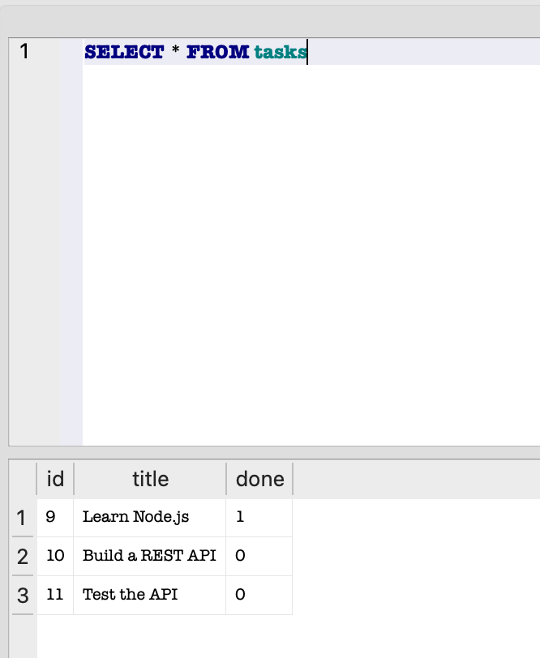

## SQLite Database

This project uses SQLite to store task data.

### Why SQLite?

SQLite was chosen because it is simple, lightweight, and does not require a separate database server. It is suitable for a small CRUD API project.

### Database Location

The database is stored in the project folder as:

`tasks.db`

If the database does not exist, the application will automatically create it when the server starts. The `tasks` table will also be created automatically.

### How to Start the Project

Install the dependencies:

```bash
npm install
```

Start the server:

```bash
node index.js
```

The server will run at:

`http://localhost:3000`

Swagger documentation is available at:

`http://localhost:3000/docs`

### Database Viewer

I used DB Browser for SQLite to view and modify the database.



### Example SQL Query

For example, I used the following query to display all tasks:

```sql
SELECT * FROM tasks;
```

This query returns every task stored in the `tasks` table.